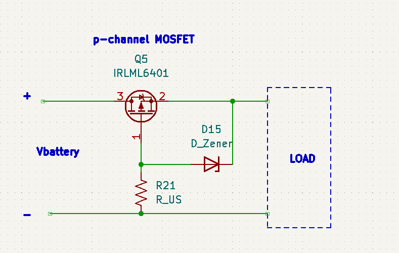

## Utility circuits for day-to-day electronic circuit design

The schematics are KiCAD files with hierachical sheets. Open the corresponding sheet to view a given part or import the whole project into your
schematic.

Below are the schematic snapshots of the circuits.

### Indicators

### Logic Shifting

### USB diode O'ring

### Battery-diode-o'ring

### I/O pins extension with 74HC595

### Reverse Proctection
